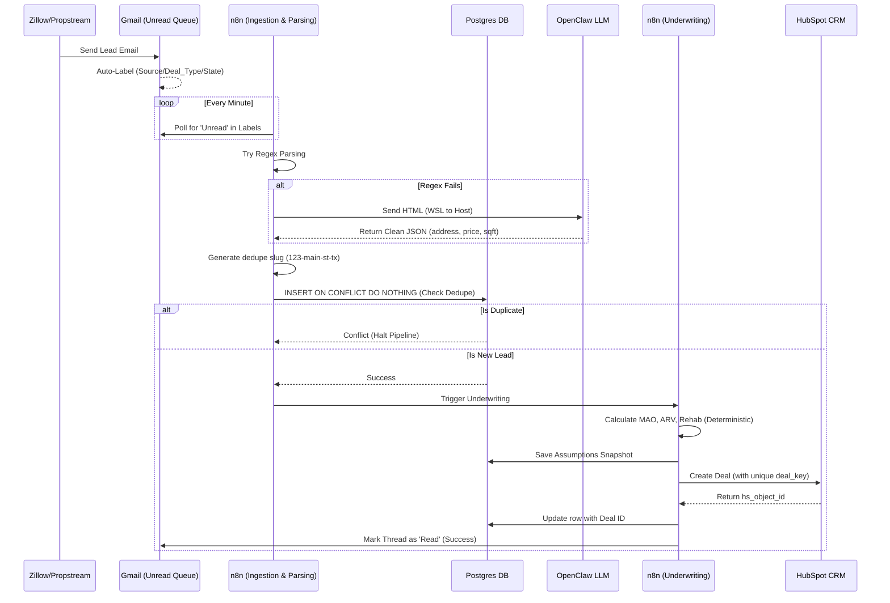
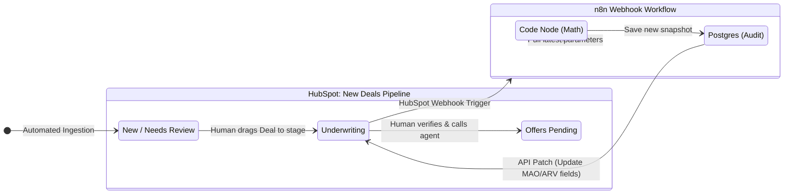

# Deal Flow System Architecture

A robust, deterministic, and scalable real estate wholesaling system that automates lead ingestion from off-market (PropStream) and on-market (Zillow) sources, normalizes them into a canonical Postgres database, underwrites them deterministically, and syncs to a HubSpot CRM for operational follow-ups.

---

## 🏗️ Target Architecture Overview

The system transitions from a monolithic automation script to a decoupled, event-driven architecture using **n8n** as the orchestrator.

### Core Systems
1. **Gmail (Ingestion Queue):** Acts as the frontline router. Incoming property emails are assigned a strict `Source / Deal_Type / State` nested label structure (e.g., `RE/Zillow/Section_8/Alabama`). n8n polls these folders for `Unread` messages, acting as a queuing mechanism.
2. **Postgres (System of Record):** The canonical database storing raw payloads, deduplication keys (`normalized_address_key`), and versioned underwriting assumptions. Provides an auditable trail and allows for batch replays.
3. **n8n (Orchestrator):** Divided into modular sub-workflows (Ingestion, Parsing, Deduplication, Underwriting, HubSpot Sync) for easier error handling and retries.
4. **OpenClaw LLM (Fallback Parser):** A local LLM running on the Windows host, accessed by the n8n WSL container. Used strictly for unstructured data extraction when standard regex fails. **Never used for math.**
5. **HubSpot (Operational CRM):** The human-facing UI. Stores Deals with unique database-level constraints (`deal_key`) to prevent duplicates.

---

## 🔄 System Data Flow

The following diagram illustrates the automated lifecycle of a lead from ingestion to CRM creation.



---

## 🧑‍💻 Human Interaction & UI Workflow

While n8n handles the data, **HubSpot** is the single pane of glass for the human team. The architecture specifically decouples underwriting from pure ingestion so that humans can trigger re-calculations asynchronously.



### Key Human Touchpoints:
1. **Dealing with Low Confidence Extraction:** If OpenClaw or Regex struggles to find a price, the lead lands in the `Needs Review` stage in HubSpot. A human finds the Zillow link (which is paramount and always attached to the Deal), manually enters the price, and moves the stage to `Underwriting`.
2. **Triggering Re-calc:** Changing a Deal stage to `Underwriting` (or clicking a custom HubSpot button) fires a webhook to n8n, which re-runs the deterministic math node against the newest variables and updates the Deal instantly.
3. **Outcome Logging:** Humans log call outcomes directly in HubSpot, which can trigger downstream drip campaigns or assignment mapping.

---

## 📂 Project Structure

```text
deal_flow/
├── n8n/                     # Orchestration logic
│   ├── workflows/           
│   │   ├── ingestion/       # A) Gmail polling, B) Parsing, C) Dedupe Gate
│   │   ├── underwrite/      # D) Webhook-triggered Underwriting compute
│   │   └── automation/      # E) HubSpot syncs, F) DLQ/Error Handling
│   └── scripts/             # JS snippets for strict deterministic math
├── hubspot/                 # CRM Definitions
│   ├── properties/          # Custom property schemas (deal_key, estimated_arv)
│   └── pipelines/           # State machine definitions
├── docs/                    
│   ├── user_stories/        # Implementation Roadmap (Phases 1-3)
│   └── system_design.md     # Expanded architecture notes
└── docker-compose.yml       # Local Postgres & n8n environment
```

## 🚀 Implementation Roadmap (See User Stories)
- **Phase 1:** Gmail Taxonomy (`Read/Unread` rules) & HubSpot Deal Key Deduplication.
- **Phase 2:** Canonical Postgres DB, Modular n8n Workflows, and Webhook-based Underwriting.
- **Phase 3:** WSL-to-Host networking for local OpenClaw LLM extraction fallbacks.
