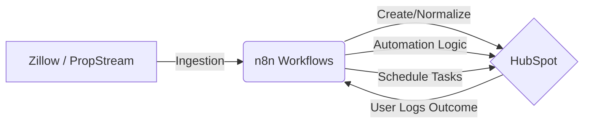

# Deal Flow System Documentation

Welcome to the **Deal Flow System** documentation. This project is a deal-centric real estate wholesaling platform that automates lead ingestion, normalization, and operational follow-up tasks.

---

## 🚀 Project Overview

The primary goal of this project is to transform HubSpot from a passive CRM into an **active sales assistant**. It solves the business problem of "lead leakage" by ensuring that every interaction—or missed interaction—with a property owner or agent triggers an intelligent, automated next step.

**Primary Outcomes:**
*   **Zero Forgotten Leads**: Automated task creation for follow-ups.
*   **Normalized Data**: Ingesting leads from Zillow and PropStream into a consistent HubSpot schema.
*   **Operational Velocity**: Moving deals through pipeline stages based on real-world call outcomes.

---

## 🏗️ System Architecture

The system consists of two major components communicating via bidirectional API calls:

1.  **HubSpot (Database of Record & UI)**: Stores Deals, Contacts, and Engagement history. It provides the user interface where sales reps log "Call Outcomes."
2.  **n8n (Automation Engine)**: The "brain" of the system. It polls HubSpot for changes, calculates timing logic, sends notifications, and updates record statuses.

**Data Flow:**

---

## ⚙️ How It Works (The "Loop")

The system operates on an **Outcome-Based Logic** loop:

1.  **Ingestion**: Leads are brought into the HubSpot "New Lead" stage.
2.  **Engagement**: A user calls a lead and logs a **Call Outcome** (e.g., *No Answer*, *Warm*, *Hot*).
3.  **Trigger**: Every minute, n8n scans HubSpot for deals marked for processing.
4.  **Routing**: n8n evaluates the outcome and branches:
    *   **Follow Up**: For *No Answer* or *Left VM*, a task is created for a retry in 1 day.
    *   **Priority**: For *Hot* or *Warm* leads, deals are moved to priority stages and tasks are created for immediate contracts/analysis.
    *   **Archive**: For *Wrong Number* or *DNC*, the deal is moved to a "Bad Data" stage to keep the pipeline clean.
5.  **Completion**: n8n marks the deal as `Processed`, clearing it from the automation queue.

---

## 🛠️ Getting Started

To set up a local development or staging environment:

1.  **Clone the Repository**: Ensure you have access to the `n8n/` and `hubspot/` configuration folders.
2.  **HubSpot Setup**: 
    *   Configure custom properties as defined in [hubspot_setup_guide.md](hubspot_setup_guide.md).
    *   Create a HubSpot Private App with `contacts` and `deals` scopes.
3.  **n8n Setup**:
    *   Import the `.json` workflows from `n8n/workflows/automation`.
    *   Create a HubSpot Credential using your Private App Access Token.
4.  **Environment Variables**: Ensure n8n has access to any required Slack or Messaging API tokens if using notification nodes.

---

## 📚 Documentation Index

| Document | Description |
| :--- | :--- |
| [**TROUBLESHOOTING.md**](TROUBLESHOOTING.md) | **Start here if things break.** Logs common pitfalls like node versioning and API "gotchas". |
| [System Design](system_design.md) | Detailed mental model for Deals, Contacts, and Pipeline stages. |
| [HubSpot Setup Guide](hubspot_setup_guide.md) | Step-by-step instructions for creating properties and pipelines in HubSpot. |
| [Automation Behavior Analysis](automation_behavior_analysis.md) | Deep dive into the timing logic and strategic rationale for each call outcome. |
| [Post-Call Automation Guide](post_call_automation_guide.md) | Technical overview of the n8n logic and poller configuration. |

---

> [!TIP]
> **Always check the Node Version**: When importing workflows, ensure your HubSpot nodes are set to **Version 2**. See [TROUBLESHOOTING.md](TROUBLESHOOTING.md#1-hubspot-n8n-node-version) for details.
